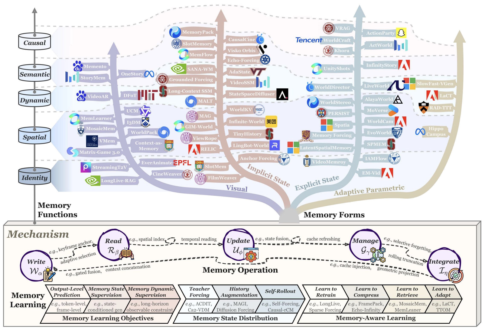
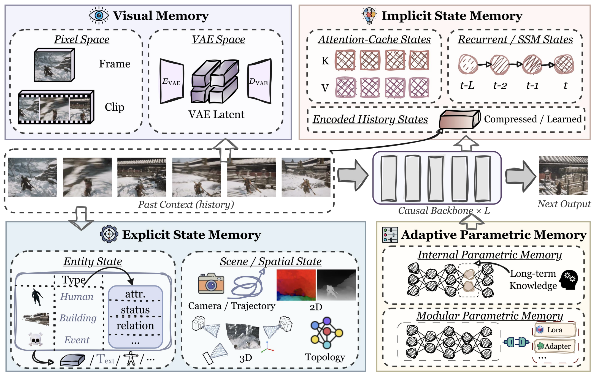

<h1 align="center">
  <strong>The Past Frames the Future:</strong>

  <strong>Memory for Autoregressive Video Generation</strong>
</h1>

<div align="center">

[](https://github.com/RongjinGuo/Awesome-AR-Video-Memory)
[](https://github.com/HaroldChen19/Awesome-AR-Video-Memory/stargazers)
[](https://github.com/HaroldChen19/Awesome-AR-Video-Memory/pulls)
[](LICENSE)

</div>

## 📢 News

- [2026/09] The repository launches with the methods and benchmarks from the survey taxonomy tables.

## 📜 Overview

[Introduction](#introduction) | [Taxonomy](#memory-carrier-taxonomy) | [Paper List](#paper-list) | [Benchmarks](#benchmarks) | [Citation](#citation) | [Contact](#contact)


<a name="introduction"></a>
## 👋 Introduction

<div align="center">
  
  <p><em>Overview of memory mechanisms in autoregressive video generation. Memory mechanisms preserve historical information beyond the active context to support long-horizon generation.</em></p>

</div>

This repository accompanies **_The Past Frames the Future: Memory for Autoregressive Video Generation — A Survey_** and provides a curated collection of memory mechanisms for autoregressive (AR) video generation and world modeling.

AR video models generate visual sequences through causal, step-wise rollouts. However, while historical dependencies continuously grow, practical systems operate with bounded context windows, storage, and computation. Memory mechanisms address this gap by preserving and reusing historical information after it leaves the active context, enabling long-term consistency of entities, scenes, dynamics, semantics, and causal changes.

Following our survey, this repository organizes existing methods from five complementary perspectives:

- **Forms**: what carries historical information;
- **Functions**: what information memory preserves;
- **Operations**: how memory is written, read, updated, managed, and integrated;
- **Learning**: how memory behaviors are acquired;
- **Evaluation**: how memory capabilities are measured.

The paper list in this repository is primarily organized by **Forms**, i.e., the underlying memory carriers, which provide a unified view of diverse mechanisms across architectures and applications.


<a name="memory-carrier-taxonomy"></a>
## 📦 Memory Forms Taxonomy


<div align="center">
  
  <p><em>Memory carriers in autoregressive video generation. A system may combine multiple carrier families to condition future generation.</em></p>
</div>

We categorize memory mechanisms into four major carrier families:

- **Visual Memory:** Preserves observation-aligned frames, clips, or visual latents as reusable historical evidence.

- **Implicit State Memory:** Retains history in model-native latent states, such as attention caches or recurrent states, without predefined semantic or geometric structures.

- **Explicit State Memory:** Represents history through structured and interpretable states, including entities, geometry, scenes, events, and relations.

- **Adaptive Parametric Memory:** Stores sequence- or experience-specific information through adapted parameters, modular weights, or parameter updates.


<a name="paper-list"></a>
## 📂 Paper List

**Paper List:** [Visual](#visual-memory) | [Implicit State](#implicit-state-memory) | [Explicit State](#explicit-state-memory) | [Adaptive Parametric](#adaptive-parametric-memory) 

<!-- METHODS:START -->

### Visual Memory

#### Pixel-space Visual Memory

- [2026/07] CineWeaver: Training-Free Reference-Controllable Multi-Shot Long Video Generation for Cinematic Storytelling. [[paper](https://arxiv.org/abs/2607.26529)]
- [2026/06] Groundshot: Visually consistent multi-shot long video generation via entity-grounded shot scheduling. [[paper](https://arxiv.org/abs/2606.20799)] [also: Explicit State]
- [2026/06] Retrieve What's Missing: Coverage-Maximizing Retrieval for Consistent Long Video Generation. [[paper](https://arxiv.org/abs/2606.02479)] [also: Explicit State]
- [2026/06] Walking in the Implicit: Interactive World Exploration via Neural Scene Representation. [[paper](https://arxiv.org/abs/2606.30045)]
- [2026/05] EverAnimate: Minute-Scale Human Animation via Latent Flow Restoration. [[paper](https://arxiv.org/abs/2605.15042)]
- [2026/05] Ge-sim 2.0: A roadmap towards comprehensive closed-loop video world simulators for robotic manipulation. [[paper](https://arxiv.org/abs/2605.27491)]
- [2026/05] StreamChar: Long-Horizon Streaming Character Audio-Video Generation with Decoupled Orchestration. [[paper](https://arxiv.org/abs/2605.25659)]
- [2026/03] I3DM: Implicit 3D-aware Memory Retrieval and Injection for Consistent Video Scene Generation. [[paper](https://arxiv.org/abs/2603.23413)] [also: Implicit State]
- [2026/03] Gloria: Consistent Character Video Generation via Content Anchors. [[paper](https://scholar.google.com/scholar?q=Gloria%3A%20Consistent%20Character%20Video%20Generation%20via%20Content%20Anchors)]
- [2026/03] ShareVerse: Multi-Agent Consistent Video Generation for Shared World Modeling. [[paper](https://arxiv.org/abs/2603.02697)]
- [2026/02] Pathwise test-time correction for autoregressive long video generation. [[paper](https://arxiv.org/abs/2602.05871)]
- [2026/01] Plenoptic video generation. [[paper](https://arxiv.org/abs/2601.05239)]
- [2025/12] End-to-end training for autoregressive video diffusion via self-resampling. [[paper](https://arxiv.org/abs/2512.15702)]
- [2025/12] Storymem: Multi-shot long video storytelling with memory. [[paper](https://arxiv.org/abs/2512.19539)] [also: Explicit State]
- [2025/10] Emu3.5: Native multimodal models are world learners. [[paper](https://arxiv.org/abs/2510.26583)]
- [2025/08] Context as memory: Scene-consistent interactive long video generation with memory retrieval. [[paper](https://scholar.google.com/scholar?q=Context%20as%20memory%3A%20Scene-consistent%20interactive%20long%20video%20generation%20with%20memory%20retrieval)]
- [2025/06] Vmem: Consistent interactive video scene generation with surfel-indexed view memory. [[paper](https://scholar.google.com/scholar?q=Vmem%3A%20Consistent%20interactive%20video%20scene%20generation%20with%20surfel-indexed%20view%20memory)] [also: Explicit State]
- [2025/04] WorldMem: Long-term Consistent World Simulation with Memory. [[paper](https://arxiv.org/abs/2504.12369)] [also: Explicit State]
- [2025/03] Long context tuning for video generation. [[paper](https://scholar.google.com/scholar?q=Long%20context%20tuning%20for%20video%20generation)]
- [2025/03] Ar-diffusion: Asynchronous video generation with auto-regressive diffusion. [[paper](https://scholar.google.com/scholar?q=Ar-diffusion%3A%20Asynchronous%20video%20generation%20with%20auto-regressive%20diffusion)]
- [2025/02] History-guided video diffusion. [[paper](https://arxiv.org/abs/2502.06764)] [also: Implicit State]
- [2024/11] Ca2-vdm: Efficient autoregressive video diffusion model with causal generation and cache sharing. [[paper](https://arxiv.org/abs/2411.16375)]
- [2024/06] Vid-gpt: Introducing gpt-style autoregressive generation in video diffusion models. [[paper](https://arxiv.org/abs/2406.10981)]
- [2024/05] Diffusion for world modeling: Visual details matter in atari. [[paper](https://scholar.google.com/scholar?q=Diffusion%20for%20world%20modeling%3A%20Visual%20details%20matter%20in%20atari)]
- [2024/02] Consisti2v: Enhancing visual consistency for image-to-video generation. [[paper](https://arxiv.org/abs/2402.04324)]
- [2024/02] Rolling diffusion models. [[paper](https://arxiv.org/abs/2402.09470)]
- [2023/11] Art-v: Auto-regressive text-to-video generation with diffusion models. [[paper](https://scholar.google.com/scholar?q=Art%E2%80%A2%20v%3A%20Auto-regressive%20text-to-video%20generation%20with%20diffusion%20models)]
- [2023/06] Video diffusion models with local-global context guidance. [[paper](https://arxiv.org/abs/2306.02562)]
- [2022/05] Mcvd: masked conditional video diffusion for prediction, generation, and interpolation. [[paper](https://scholar.google.com/scholar?q=Mcvd-masked%20conditional%20video%20diffusion%20for%20prediction%2C%20generation%2C%20and%20interpolation)]

#### VAE-space Visual Memory

- [2026/08] ContextMaster: Interactive Multi-Shot Video Creation via Fixed-Budget Sparse Context Routing. [[paper](https://arxiv.org/abs/2608.04956)]
- [2026/08] Long-Horizon Audio-Visual Generation for Persistent Stories and Interactive Worlds. [[paper](https://arxiv.org/abs/2608.23383)]
- [2026/06] From Zero to Hero: Training-Free Custom Concept Spawning in World Models. [[paper](https://arxiv.org/abs/2606.02575)]
- [2026/06] Learning Transferable Dynamics Priors from Action to World Modeling. [[paper](https://arxiv.org/abs/2606.29501)]
- [2026/06] LongLive-RAG: A General Retrieval-Augmented Framework for Long Video Generation. [[paper](https://arxiv.org/abs/2606.02553)]
- [2026/06] MemLearner: Learning to Query Context memory for Video World Models. [[paper](https://arxiv.org/abs/2606.31734)]
- [2026/05] DecMem: Towards Minute-Long Consistent World Generation with Decoupled Memory. [[paper](https://arxiv.org/abs/2605.31336)]
- [2026/05] Light Interaction: Training-Free Inference Acceleration for Interactive Video World Models. [[paper](https://arxiv.org/abs/2605.31158)]
- [2026/04] Matrix-game 3.0: Real-time and streaming interactive world model with long-horizon memory. [[paper](https://arxiv.org/abs/2604.08995)]
- [2026/04] Memorize When Needed: Decoupled Memory Control for Spatially Consistent Long-Horizon Video Generation. [[paper](https://arxiv.org/abs/2604.18215)]
- [2026/03] MemCam: Memory-Augmented Camera Control for Consistent Video Generation. [[paper](https://arxiv.org/abs/2603.26193)]
- [2026/03] MosaicMem: Hybrid Spatial Memory for Controllable Video World Models. [[paper](https://arxiv.org/abs/2603.17117)] [also: Explicit State]
- [2026/03] Out of sight but not out of mind: Hybrid memory for dynamic video world models. [[paper](https://arxiv.org/abs/2603.25716)] [also: Implicit State]
- [2026/03] Persistent robot world models: Stabilizing multi-step rollouts via reinforcement learning. [[paper](https://arxiv.org/abs/2603.25685)]
- [2026/02] TokenTrim: Inference-Time Token Pruning for Autoregressive Long Video Generation. [[paper](https://arxiv.org/abs/2602.00268)]
- [2026/02] UCM: Unified Modeling of Camera Control and Memory with Time-aware Positional Encoding Warping for World Models. [[paper](https://arxiv.org/abs/2602.22960)] [also: Explicit State]
- [2026/02] Live: Long-horizon interactive video world modeling. [[paper](https://arxiv.org/abs/2602.03747)]
- [2025/12] Onestory: Coherent multi-shot video generation with adaptive memory. [[paper](https://scholar.google.com/scholar?q=Onestory%3A%20Coherent%20multi-shot%20video%20generation%20with%20adaptive%20memory)] [also: Explicit State]
- [2025/12] Astra: General interactive world model with autoregressive denoising. [[paper](https://scholar.google.com/scholar?q=Astra%3A%20General%20interactive%20world%20model%20with%20autoregressive%20denoising)]
- [2025/12] Yume1.5: A text-controlled interactive world generation model. [[paper](https://scholar.google.com/scholar?q=Yume1.%205%3A%20A%20text-controlled%20interactive%20world%20generation%20model)]
- [2025/12] Bagger: Backwards aggregation for mitigating drift in autoregressive video diffusion models. [[paper](https://scholar.google.com/scholar?q=Bagger%3A%20Backwards%20aggregation%20for%20mitigating%20drift%20in%20autoregressive%20video%20diffusion%20models)]
- [2025/12] Worldpack: Compressed memory improves spatial consistency in video world modeling. [[paper](https://arxiv.org/abs/2512.02473)] [also: Implicit State]
- [2025/12] WorldPlay: Towards Long-Term Geometric Consistency for Real-Time Interactive World Modeling. [[paper](https://arxiv.org/abs/2512.14614)]
- [2025/11] MagicWorld: Towards Long-Horizon Stability for Interactive Video World Exploration. [[paper](https://arxiv.org/abs/2511.18886)]
- [2025/11] InfinityStar: Unified Spacetime AutoRegressive Modeling for Visual Generation. [[paper](https://scholar.google.com/scholar?q=InfinityStar%3A%20Unified%20Spacetime%20AutoRegressive%20Modeling%20for%20Visual%20Generation)]
- [2025/10] Stable video infinity: Infinite-length video generation with error recycling. [[paper](https://scholar.google.com/scholar?q=Stable%20video%20infinity%3A%20Infinite-length%20video%20generation%20with%20error%20recycling)]
- [2025/09] SAMPO: Scale-wise Autoregression with Motion PrOmpt for generative world models. [[paper](https://scholar.google.com/scholar?q=SAMPO%3A%20Scale-wise%20Autoregression%20with%20Motion%20PrOmpt%20for%20generative%20world%20models)]
- [2025/05] Generative pre-trained autoregressive diffusion transformer. [[paper](https://scholar.google.com/scholar?q=Generative%20pre-trained%20autoregressive%20diffusion%20transformer)]
- [2025/05] VRAG: Learning World Models for Interactive Video Generation. [[paper](https://arxiv.org/abs/2505.21996)] [also: Explicit State]
- [2025/04] Skyreels-v2: Infinite-length film generative model. [[paper](https://arxiv.org/abs/2504.13074)]
- [2025/04] Frame context packing and drift prevention in next-frame-prediction video diffusion models. [[paper](https://scholar.google.com/scholar?q=Frame%20context%20packing%20and%20drift%20prevention%20in%20next-frame-prediction%20video%20diffusion%20models)] [also: Implicit State]
- [2025/01] Ouroboros-diffusion: Exploring consistent content generation in tuning-free long video diffusion. [[paper](https://scholar.google.com/scholar?q=Ouroboros-diffusion%3A%20Exploring%20consistent%20content%20generation%20in%20tuning-free%20long%20video%20diffusion)]
- [2024/10] Loong: Generating minute-level long videos with autoregressive language models. [[paper](https://arxiv.org/abs/2410.02757)]
- [2024/10] Progressive autoregressive video diffusion models. [[paper](https://scholar.google.com/scholar?q=Progressive%20autoregressive%20video%20diffusion%20models)]
- [2024/09] Emu3: Next-token prediction is all you need. [[paper](https://arxiv.org/abs/2409.18869)]
- [2024/08] Diffusion models are real-time game engines. [[paper](https://scholar.google.com/scholar?q=Diffusion%20models%20are%20real-time%20game%20engines)]
- [2024/05] Fifo-diffusion: Generating infinite videos from text without training. [[paper](https://scholar.google.com/scholar?q=Fifo-diffusion%3A%20Generating%20infinite%20videos%20from%20text%20without%20training)] [also: Implicit State]
- [2024/03] Streamingt2v: Consistent, dynamic, and extendable long video generation from text. [[paper](https://scholar.google.com/scholar?q=Streamingt2v%3A%20Consistent%2C%20dynamic%2C%20and%20extendable%20long%20video%20generation%20from%20text)]
- [2023/12] Videopoet: A large language model for zero-shot video generation. [[paper](https://arxiv.org/abs/2312.14125)]
- [2022/11] Latent video diffusion models for high-fidelity long video generation. [[paper](https://arxiv.org/abs/2211.13221)]
- [2022/11] Efficient video prediction via sparsely conditioned flow matching. [[paper](https://scholar.google.com/scholar?q=Efficient%20video%20prediction%20via%20sparsely%20conditioned%20flow%20matching)]
- [2022/03] Diffusion probabilistic modeling for video generation. [[paper](https://scholar.google.com/scholar?q=Diffusion%20probabilistic%20modeling%20for%20video%20generation)]
- [2021/04] Videogpt: Video generation using vq-vae and transformers. [[paper](https://arxiv.org/abs/2104.10157)]


### Implicit State Memory

#### Attention-cache States

- [2026/08] Addressable Memory for Video World Models. [[paper](https://arxiv.org/abs/2608.07408)]
- [2026/08] DensityKV: Density-Guided KV Cache Compression for Long Video Generation. [[paper](https://arxiv.org/abs/2608.27922)]
- [2026/08] LayerRecall: A State-Conditioned Memory Router for Long-Horizon Consistency in Video Generation. [[paper](https://arxiv.org/abs/2608.28460)]
- [2026/08] LiveAnimate: Stable Long-Form Streaming Human Animation in Real-Time. [[paper](https://arxiv.org/abs/2608.11745)]
- [2026/08] Omni-LiveAvatar: Minute-Level Real-Time Streaming Joint Audio-Visual Avatar Generation. [[paper](https://arxiv.org/abs/2608.13602)]
- [2026/08] ReWorld: An Interactive World Model with Long-Horizon Memory. [[paper](https://arxiv.org/abs/2608.23565)]
- [2026/08] Ring Forcing: Towards Precise Long-Term Memory for Autoregressive Video Diffusion. [[paper](https://arxiv.org/abs/2608.26794)]
- [2026/08] SparSTAR: Sparse Attention for SpaceTime AutoRegressive Video Synthesis. [[paper](https://arxiv.org/abs/2608.10519)]
- [2026/08] Tether the Subject, Release the Scene: Query-Aware Memory Routing for Long-Horizon Autoregressive Video Generation. [[paper](https://arxiv.org/abs/2608.26902)]
- [2026/08] UniSwap: Streaming Audio-Visual Identity Swapping for Talking Videos. [[paper](https://arxiv.org/abs/2608.11752)]
- [2026/08] RECAP-Forcing: Retaining Content Appearances for Long Video Generation. [[paper](https://arxiv.org/abs/2608.26671)]
- [2026/07] Closing the Loop: Training-Free Revisit Consistency for Autoregressive Generative Rendering. [[paper](https://arxiv.org/abs/2607.21848)]
- [2026/07] FreqForcing: Autoregressive Long Video Generation via Spectral Self-Anchoring. [[paper](https://arxiv.org/abs/2607.27110)]
- [2026/07] HeadCast: Casting Attention Heads for Efficient Autoregressive Video Generation. [[paper](https://arxiv.org/abs/2607.20125)]
- [2026/07] OPSD-V: On-Policy Self-Distillation for Post-Training Few-Step Autoregressive Video Generators. [[paper](https://arxiv.org/abs/2607.08766)]
- [2026/07] Self Gradient Forcing: Native Long Video Extrapolation. [[paper](https://arxiv.org/abs/2607.20368)]
- [2026/07] Surprise Forcing: What to Remember, When to Skip in Long Video Generation. [[paper](https://arxiv.org/abs/2607.18436)]
- [2026/07] Wonder: Video World Model Done Better. [[paper](https://arxiv.org/abs/2607.26037)]
- [2026/07] Cycle-World: Mitigating Error Accumulation in Long-term Video World Models via Reverse-Prediction Cycle Consistency. [[paper](https://arxiv.org/abs/2607.11836)]
- [2026/06] FadeMem: Distance-Aware Memory Consolidation for Autoregressive Video Diffusion. [[paper](https://arxiv.org/abs/2606.10671)]
- [2026/06] TetherCache: Stabilizing Autoregressive Long-Form Video Generation with Gated Recall and Trusted Alignment. [[paper](https://arxiv.org/abs/2606.13035)]
- [2026/06] Wan-Streamer v0. 1: End-to-end Real-time Interactive Foundation Models. [[paper](https://arxiv.org/abs/2606.25041)]
- [2026/06] Towards Error-Free Long Video Generation. [[paper](https://arxiv.org/abs/2606.22370)]
- [2026/06] Causal-rCM: A Unified Teacher-Forcing and Self-Forcing Open Recipe for Autoregressive Diffusion Distillation in Streaming Video Generation and Interactive World Models. [[paper](https://arxiv.org/abs/2606.25473)]
- [2026/05] CausalCine: Real-Time Autoregressive Generation for Multi-Shot Video Narratives. [[paper](https://arxiv.org/abs/2605.12496)]
- [2026/05] DySink: Dynamic Frame Sinks for Autoregressive Long Video Generation. [[paper](https://arxiv.org/abs/2605.21028)]
- [2026/05] Echo-Forcing: A Scene Memory Framework for Interactive Long Video Generation. [[paper](https://arxiv.org/abs/2605.16003)]
- [2026/05] Focused Forcing: Content-Aware Per-Frame KV Selection for Efficient Autoregressive Video Diffusion. [[paper](https://arxiv.org/abs/2605.18346)]
- [2026/05] Forcing-KV: Hybrid KV Cache Compression for Efficient Autoregressive Video Diffusion Models. [[paper](https://arxiv.org/abs/2605.09681)]
- [2026/05] Future Forcing: Future-aware Training-free KV Cache Policy for Autoregressive Video Generation. [[paper](https://arxiv.org/abs/2605.30083)]
- [2026/05] Head Forcing: Long Autoregressive Video Generation via Head Heterogeneity. [[paper](https://arxiv.org/abs/2605.14487)]
- [2026/05] LongLive-2.0: An NVFP4 Parallel Infrastructure for Long Video Generation. [[paper](https://arxiv.org/abs/2605.18739)]
- [2026/05] OmniMem: Scalable and Adaptive Memory Retrieval for Long Video Generation. [[paper](https://arxiv.org/abs/2605.30519)]
- [2026/05] Pyramid Forcing: Head-Aware Pyramid KV Cache Policy for High-Quality Long Video Generation. [[paper](https://arxiv.org/abs/2605.13111)]
- [2026/05] Quantized Keys Steal Attention: Bias Correction for KV-Cache Compression in Video Diffusion. [[paper](https://arxiv.org/abs/2605.26266)]
- [2026/05] SlotMemory: Object-Centric KV Memory for Streaming Long-Video Generation. [[paper](https://arxiv.org/abs/2605.31033)] [also: Explicit State]
- [2026/05] Stream-T1: Test-Time Scaling for Streaming Video Generation. [[paper](https://arxiv.org/abs/2605.04461)]
- [2026/05] SWIFT: Prompt-Adaptive Memory for Efficient Interactive Long Video Generation. [[paper](https://arxiv.org/abs/2605.09442)] [also: Visual]
- [2026/05] Teaching Video Generators to Remember: Eliciting Dynamic Memory for Out-of-Sight State Evolution. [[paper](https://arxiv.org/abs/2605.25333)]
- [2026/05] VideoMLA: Low-Rank Latent KV Cache for Minute-Scale Autoregressive Video Diffusion. [[paper](https://arxiv.org/abs/2605.30351)]
- [2026/05] WorldCraft: From Camera Navigation to Object Manipulation in Interactive Video World Models. [[paper](https://arxiv.org/abs/2605.25077)] [also: Explicit State]
- [2026/05] WorldKV: Efficient World Memory with World Retrieval and Compression. [[paper](https://arxiv.org/abs/2605.22718)]
- [2026/05] Delta Forcing: Trust Region Steering for Interactive Autoregressive Video Generation. [[paper](https://arxiv.org/abs/2605.14382)]
- [2026/05] RAVEN: Real-time Autoregressive Video Extrapolation with Consistency-model GRPO. [[paper](https://arxiv.org/abs/2605.15190)]
- [2026/04] Grounded forcing: Bridging time-independent semantics and proximal dynamics in autoregressive video synthesis. [[paper](https://arxiv.org/abs/2604.06939)]
- [2026/04] Inspatio-world: A real-time 4d world simulator via spatiotemporal autoregressive modeling. [[paper](https://arxiv.org/abs/2604.07209)] [also: Visual, Explicit State]
- [2026/04] Salt: Self-consistent distribution matching with cache-aware training for fast video generation. [[paper](https://arxiv.org/abs/2604.03118)]
- [2026/04] Sparse forcing: Native trainable sparse attention for real-time autoregressive diffusion video generation. [[paper](https://arxiv.org/abs/2604.21221)]
- [2026/03] Anchor Forcing: Anchor Memory and Tri-Region RoPE for Interactive Streaming Video Diffusion. [[paper](https://arxiv.org/abs/2603.13405)]
- [2026/03] Memrope: Training-free infinite video generation via evolving memory tokens. [[paper](https://arxiv.org/abs/2603.12513)]
- [2026/03] PackForcing: Short Video Training Suffices for Long Video Sampling and Long Context Inference. [[paper](https://arxiv.org/abs/2603.25730)]
- [2026/03] Relax forcing: Relaxed kv-memory for consistent long video generation. [[paper](https://arxiv.org/abs/2603.21366)]
- [2026/03] Shotstream: Streaming multi-shot video generation for interactive storytelling. [[paper](https://arxiv.org/abs/2603.25746)]
- [2026/03] Streaming autoregressive video generation via diagonal distillation. [[paper](https://arxiv.org/abs/2603.09488)]
- [2026/02] Causal forcing: Autoregressive diffusion distillation done right for high-quality real-time interactive video generation. [[paper](https://arxiv.org/abs/2602.02214)]
- [2026/02] Context forcing: Consistent autoregressive video generation with long context. [[paper](https://arxiv.org/abs/2602.06028)]
- [2026/02] Flow caching for autoregressive video generation. [[paper](https://arxiv.org/abs/2602.10825)]
- [2026/02] Geometry-aware rotary position embedding for consistent video world model. [[paper](https://arxiv.org/abs/2602.07854)]
- [2026/02] Light forcing: Accelerating autoregressive video diffusion via sparse attention. [[paper](https://arxiv.org/abs/2602.04789)]
- [2026/02] Quant videogen: Auto-regressive long video generation via 2-bit kv-cache quantization. [[paper](https://arxiv.org/abs/2602.02958)]
- [2026/02] Rolling sink: Bridging limited-horizon training and open-ended testing in autoregressive video diffusion. [[paper](https://arxiv.org/abs/2602.07775)]
- [2026/02] FAST-AR: Fast Autoregressive Video Diffusion and World Models with Temporal Cache Compression and Sparse Attention. [[paper](https://scholar.google.com/scholar?q=FAST-AR%3A%20Fast%20Autoregressive%20Video%20Diffusion%20and%20World%20Models%20with%20Temporal%20Cache%20Compression%20and%20Sparse%20Attention)]
- [2026/01] Advancing open-source world models. [[paper](https://arxiv.org/abs/2601.20540)]
- [2026/01] Efficient autoregressive video diffusion with dummy head. [[paper](https://arxiv.org/abs/2601.20499)]
- [2026/01] Lol: Longer than longer, scaling video generation to hour. [[paper](https://arxiv.org/abs/2601.16914)]
- [2026/01] Past-and future-informed kv cache policy with salience estimation in autoregressive video diffusion. [[paper](https://arxiv.org/abs/2601.21896)]
- [2026/01] StableWorld: Towards Stable and Consistent Long Interactive Video Generation. [[paper](https://arxiv.org/abs/2601.15281)]
- [2026/01] VideoAR: Autoregressive Video Generation via Next-Frame & Scale Prediction. [[paper](https://arxiv.org/abs/2601.05966)] [also: Visual]
- [2025/12] Deep forcing: Training-free long video generation with deep sink and participative compression. [[paper](https://arxiv.org/abs/2512.05081)]
- [2025/12] Filmweaver: Weaving consistent multi-shot videos with cache-guided autoregressive diffusion. [[paper](https://scholar.google.com/scholar?q=Filmweaver%3A%20Weaving%20consistent%20multi-shot%20videos%20with%20cache-guided%20autoregressive%20diffusion)]
- [2025/12] Egolcd: Egocentric video generation with long context diffusion. [[paper](https://arxiv.org/abs/2512.04515)]
- [2025/12] JoyStreamer-Flash: Real-time and Infinite Audio-Driven Avatar Generation with Autoregressive Diffusion. [[paper](https://arxiv.org/abs/2512.11423)] [also: Explicit State]
- [2025/12] Reward forcing: Efficient streaming video generation with rewarded distribution matching distillation. [[paper](https://scholar.google.com/scholar?q=Reward%20forcing%3A%20Efficient%20streaming%20video%20generation%20with%20rewarded%20distribution%20matching%20distillation)]
- [2025/12] Knot forcing: Taming autoregressive video diffusion models for real-time infinite interactive portrait animation. [[paper](https://arxiv.org/abs/2512.21734)]
- [2025/12] LiveTalk: Real-Time Multimodal Interactive Video Diffusion via Improved On-Policy Distillation. [[paper](https://arxiv.org/abs/2512.23576)] [also: Explicit State]
- [2025/12] Memflow: Flowing adaptive memory for consistent and efficient long video narratives. [[paper](https://arxiv.org/abs/2512.14699)]
- [2025/12] Memorize-and-generate: Towards long-term consistency in real-time video generation. [[paper](https://arxiv.org/abs/2512.18741)]
- [2025/12] Relic: Interactive video world model with long-horizon memory. [[paper](https://arxiv.org/abs/2512.04040)]
- [2025/12] SneakPeek: Future-Guided Instructional Streaming Video Generation. [[paper](https://arxiv.org/abs/2512.13019)]
- [2025/11] BIFE: Better Interaction, Fewer Errors for Minute-Long Video Generation. [[paper](https://arxiv.org/abs/2511.22973)]
- [2025/11] Infinity-RoPE: Action-Controllable Infinite Video Generation Emerges From Autoregressive Self-Rollout. [[paper](https://arxiv.org/abs/2511.20649)]
- [2025/10] Self-forcing++: Towards minute-scale high-quality video generation. [[paper](https://scholar.google.com/scholar?q=Self-forcing%2B%2B%3A%20Towards%20minute-scale%20high-quality%20video%20generation)]
- [2025/09] Longlive: Real-time interactive long video generation. [[paper](https://arxiv.org/abs/2509.22622)]
- [2025/09] Causnvs: Autoregressive multi-view diffusion for flexible 3d novel view synthesis. [[paper](https://arxiv.org/abs/2509.06579)] [also: Explicit State]
- [2025/09] Autoregressive Video Generation beyond Next Frames Prediction. [[paper](https://arxiv.org/abs/2509.24081)]
- [2025/09] Rolling forcing: Autoregressive long video diffusion in real time. [[paper](https://scholar.google.com/scholar?q=Rolling%20forcing%3A%20Autoregressive%20long%20video%20diffusion%20in%20real%20time)]
- [2025/06] Self forcing: Bridging the train-test gap in autoregressive video diffusion. [[paper](https://scholar.google.com/scholar?q=Self%20forcing%3A%20Bridging%20the%20train-test%20gap%20in%20autoregressive%20video%20diffusion)]
- [2025/06] Videomar: Autoregressive video generation with continuous tokens. [[paper](https://scholar.google.com/scholar?q=Videomar%3A%20Autoregressive%20video%20generation%20with%20continuous%20tokens)]
- [2025/05] Magi-1: Autoregressive video generation at scale. [[paper](https://arxiv.org/abs/2505.13211)]
- [2025/03] Long-context autoregressive video modeling with next-frame prediction. [[paper](https://arxiv.org/abs/2503.19325)]
- [2025/01] Taming teacher forcing for masked autoregressive video generation. [[paper](https://scholar.google.com/scholar?q=Taming%20teacher%20forcing%20for%20masked%20autoregressive%20video%20generation)]
- [2024/12] Acdit: Interpolating autoregressive conditional modeling and diffusion transformer. [[paper](https://arxiv.org/abs/2412.07720)]
- [2024/12] From slow bidirectional to fast autoregressive video diffusion models. [[paper](https://scholar.google.com/scholar?q=From%20slow%20bidirectional%20to%20fast%20autoregressive%20video%20diffusion%20models)]
- [2024/12] Autoregressive video generation without vector quantization. [[paper](https://scholar.google.com/scholar?q=Autoregressive%20video%20generation%20without%20vector%20quantization)]

#### Recurrent and State-space States

- [2026/07] Ripple: Real-Time Streaming Audio-Video Generation With Cross-Modal Recurrent Memory. [[paper](https://arxiv.org/abs/2607.26818)]
- [2026/07] TaoMate: Anchor-Guided Memory Bridging Evolving and Reference States for Real-Time Audio-Video Digital Human Generation. [[paper](https://arxiv.org/abs/2607.24359)]
- [2026/07] Visko Orbis 1.0: A Live Model for Real-Time Interactive Long Video Generation. [[paper](https://arxiv.org/abs/2607.26694)]
- [2026/06] Next forcing: Causal world modeling with multi-chunk prediction. [[paper](https://arxiv.org/abs/2606.11187)]
- [2026/06] Steady-Forcing: Balancing Spatial Persistence and Motion Continuity in Long-Horizon Nature Video Diffusion. [[paper](https://arxiv.org/abs/2606.14732)]
- [2026/06] Ultra Flash: Scaling Real-Time Streaming Video Generation to High Resolutions. [[paper](https://arxiv.org/abs/2606.09150)]
- [2026/06] UnityShots: Memory-Driven Multi-Shot Audio-Video Generation with Boundary-Aware Gating. [[paper](https://arxiv.org/abs/2606.21661)] [also: Visual]
- [2026/05] AdaState: Self-Evolving Anchors for Streaming Video Generation. [[paper](https://arxiv.org/abs/2605.30349)]
- [2026/05] Attend Locally, Remember Linearly: Linear Attention as Cross-Frame Memory for Autoregressive Video Diffusion. [[paper](https://arxiv.org/abs/2605.16579)]
- [2026/05] Sana-wm: Efficient minute-scale world modeling with hybrid linear diffusion transformer. [[paper](https://arxiv.org/abs/2605.15178)]
- [2026/04] Long-Horizon Streaming Video Generation via Hybrid Attention with Decoupled Distillation. [[paper](https://arxiv.org/abs/2604.10103)]
- [2026/03] SoulX-LiveAct: Towards Hour-Scale Real-Time Human Animation with Neighbor Forcing and ConvKV Memory. [[paper](https://arxiv.org/abs/2603.11746)]
- [2026/01] S2dit: Sandwich diffusion transformer for mobile streaming video generation. [[paper](https://arxiv.org/abs/2601.12719)]
- [2026/01] ReHyAt: Recurrent Hybrid Attention for Video Diffusion Transformers. [[paper](https://scholar.google.com/scholar?q=ReHyAt%3A%20Recurrent%20Hybrid%20Attention%20for%20Video%20Diffusion%20Transformers)]
- [2025/12] Videossm: Autoregressive long video generation with hybrid state-space memory. [[paper](https://arxiv.org/abs/2512.04519)]
- [2025/10] Pack and Force Your Memory: Long-form and Consistent Video Generation. [[paper](https://arxiv.org/abs/2510.01784)] [also: Visual]
- [2025/05] StateSpaceDiffuser: Bringing Long Context to Diffusion World Models. [[paper](https://arxiv.org/abs/2505.22246)]
- [2025/02] EDELINE: Enhancing Memory in Diffusion-based World Models via Linear-Time Sequence Modeling. [[paper](https://arxiv.org/abs/2502.00466)]
- [2025/02] Malt diffusion: Memory-augmented latent transformers for any-length video generation. [[paper](https://arxiv.org/abs/2502.12632)]
- [2025/05] Long-context state-space video world models. [[paper](https://scholar.google.com/scholar?q=Long-context%20state-space%20video%20world%20models)]

#### Encoded History States

- [2026/06] Compression and Retrieval: Implicit Memory Retrieval for Video World Models. [[paper](https://arxiv.org/abs/2606.23105)]
- [2026/06] Echo-Infinity: Learning Evolving Memory for Real-Time Infinite Video Generation. [[paper](https://arxiv.org/abs/2606.04527)]
- [2026/06] Geometry-Aware Implicit Memory for Video World Models. [[paper](https://arxiv.org/abs/2606.02436)]
- [2026/06] InteractiveAvatar: Real-Time Streaming Video Generation for Consistent and Intent-Aware Avatars. [[paper](https://arxiv.org/abs/2606.22905)]
- [2026/02] Infinite-world: Scaling interactive world models to 1000-frame horizons via pose-free hierarchical memory. [[paper](https://arxiv.org/abs/2602.02393)]
- [2025/12] TinyHistory: Lightweight Video History Embeddings via Two-Stage Context Learning. [[paper](https://arxiv.org/abs/2512.23851)]

### Explicit State Memory

#### Entity-centric States

- [2026/08] Code World Model: Coding Agent as World Brain. [[paper](https://arxiv.org/abs/2608.25927)]
- [2026/08] Learning How the World Evolves: Extrapolative Video World Models via Latent Dynamics Reasoning. [[paper](https://arxiv.org/abs/2608.09926)]
- [2026/08] Population-Scalable Multi-Agent World Modeling. [[paper](https://arxiv.org/abs/2608.08600)]
- [2026/07] SlotMem: Character-Addressable Internal Memory for Narrative Long Video Generation. [[paper](https://arxiv.org/abs/2607.15772)] [also: Implicit State]
- [2026/07] WorldDirector: Building Controllable World Simulators with Persistent Dynamic Memory. [[paper](https://arxiv.org/abs/2607.02517)]
- [2026/06] ActWorld: From Explorable to Interactive World Model via Action-Aware Memory. [[paper](https://arxiv.org/abs/2606.17730)] [also: Implicit State]
- [2026/06] Closed-Loop Triplet Synergistic Generation for Long-Form Video. [[paper](https://arxiv.org/abs/2606.16184)]
- [2026/06] Memento: Reconstruct to Remember for Consistent Long Video Generation. [[paper](https://arxiv.org/abs/2606.14667)] [also: Visual]
- [2026/05] A^2RD: Agentic Autoregressive Diffusion for Long Video Consistency. [[paper](https://arxiv.org/abs/2605.06924)]
- [2026/05] Advancing Narrative Long Video Generation via Training-Free Identity-Aware Memory. [[paper](https://arxiv.org/abs/2605.18733)]
- [2026/05] EM-Vid: Training-Free Entity-Centric Memory for Efficient and Consistent Multi-Shot Video Generation. [[paper](https://arxiv.org/abs/2605.23610)]
- [2026/05] ReCA: Multi-Shot Long Video Extrapolation via Recursive Context Allocation. [[paper](https://arxiv.org/abs/2605.26525)] [also: Visual]
- [2026/04] ActionParty: Multi-Subject Action Binding in Generative Video Games. [[paper](https://arxiv.org/abs/2604.02330)]
- [2026/03] Infinitystory: Unlimited video generation with world consistency and character-aware shot transitions. [[paper](https://arxiv.org/abs/2603.03646)]
- [2026/03] Multigen: Level-design for editable multiplayer worlds in diffusion game engines. [[paper](https://arxiv.org/abs/2603.06679)]
- [2026/03] SPIRAL: Self-Evolving Action-Conditioned Video Generation via Reflective Planning Agents. [[paper](https://arxiv.org/abs/2603.08403)]
- [2026/01] Videomemory: Toward consistent video generation via memory integration. [[paper](https://arxiv.org/abs/2601.03655)] [also: Visual]
- [2025/12] Egox: Egocentric video generation from a single exocentric video. [[paper](https://scholar.google.com/scholar?q=Egox%3A%20Egocentric%20video%20generation%20from%20a%20single%20exocentric%20video)]

#### Spatial and Geometric States

- [2026/08] Alaya-EVOKE: From Linear-Scaling Supervision to Endless World. [[paper](https://arxiv.org/abs/2608.13546)]
- [2026/07] AlayaWorld: Interactive Long-Horizon World Modeling--Full Technical Report. [[paper](https://arxiv.org/abs/2607.18367)] [also: Visual, Implicit State]
- [2026/06] DreamX-World 1.0: A General-Purpose Interactive World Model. [[paper](https://arxiv.org/abs/2606.16993)] [also: Visual]
- [2026/06] Geostream: Toward precise camera controlled streaming video generation. [[paper](https://arxiv.org/abs/2606.15162)]
- [2026/06] Latent spatial memory for video world models. [[paper](https://arxiv.org/abs/2606.09828)] [also: Visual]
- [2026/06] Mem-World: Memory-Augmented Action-Conditioned World Models for Persistent Robot Manipulation. [[paper](https://arxiv.org/abs/2606.18960)] [also: Visual]
- [2026/06] MoVerse: Real-Time Video World Modeling with Panoramic Gaussian Scaffold. [[paper](https://arxiv.org/abs/2606.13376)]
- [2026/05] PanoWorld: Geometry-Consistent Panoramic Video World Modeling. [[paper](https://arxiv.org/abs/2605.15391)]
- [2026/05] Robust Dreamer: Deviation-Aware Latent Gaussian Memory for Action-Controlled AR Video Generation. [[paper](https://arxiv.org/abs/2605.30855)]
- [2026/04] Lyra 2.0: Explorable generative 3d worlds. [[paper](https://arxiv.org/abs/2604.13036)] [also: Visual]
- [2026/04] Egosim: Egocentric world simulator for embodied interaction generation. [[paper](https://arxiv.org/abs/2604.01001)]
- [2026/04] Matrix-Game 3.5: Enhancing Real-Time Streaming Interactive World Models with Patch Memory. [[paper](https://matrix-game-v3-5.github.io/)]
- [2026/03] Liveworld: Simulating out-of-sight dynamics in generative video world models. [[paper](https://arxiv.org/abs/2603.07145)] [also: Implicit State]
- [2026/03] Worldcam: Interactive autoregressive 3d gaming worlds with camera pose as a unifying geometric representation. [[paper](https://arxiv.org/abs/2603.16871)] [also: Visual]
- [2026/03] Beyond pixel histories: World models with persistent 3d state. [[paper](https://scholar.google.com/scholar?q=Beyond%20pixel%20histories%3A%20World%20models%20with%20persistent%203d%20state)]
- [2026/03] WorldStereo: Bridging Camera-Guided Video Generation and Scene Reconstruction via 3D Geometric Memories. [[paper](https://arxiv.org/abs/2603.02049)]
- [2026/02] Anchorweave: World-consistent video generation with retrieved local spatial memories. [[paper](https://arxiv.org/abs/2602.14941)]
- [2026/02] Geometry-as-context: Modulating explicit 3d in scene-consistent video generation to geometry context. [[paper](https://scholar.google.com/scholar?q=Geometry-as-context%3A%20Modulating%20explicit%203d%20in%20scene-consistent%20video%20generation%20to%20geometry%20context)]
- [2026/01] Teleworld: Towards dynamic multimodal synthesis with a 4d world model. [[paper](https://arxiv.org/abs/2601.00051)]
- [2025/12] Spatia: Video generation with updatable spatial memory. [[paper](https://scholar.google.com/scholar?q=Spatia%3A%20Video%20generation%20with%20updatable%20spatial%20memory)]
- [2025/11] Captain safari: A world engine with pose-aligned 3d memory. [[paper](https://scholar.google.com/scholar?q=Captain%20safari%3A%20A%20world%20engine%20with%20pose-aligned%203d%20memory)]
- [2025/10] EvoWorld: Evolving Panoramic World Generation with Explicit 3D Memory. [[paper](https://arxiv.org/abs/2510.01183)]
- [2025/10] Memory forcing: Spatio-temporal memory for consistent scene generation on minecraft. [[paper](https://arxiv.org/abs/2510.03198)]
- [2025/08] Worldweaver: Generating long-horizon video worlds via rich perception. [[paper](https://scholar.google.com/scholar?q=Worldweaver%3A%20Generating%20long-horizon%20video%20worlds%20via%20rich%20perception)] [also: Visual]
- [2025/06] Deepverse: 4d autoregressive video generation as a world model. [[paper](https://arxiv.org/abs/2506.01103)] [also: Implicit State]
- [2025/06] Video world models with long-term spatial memory. [[paper](https://scholar.google.com/scholar?q=Video%20world%20models%20with%20long-term%20spatial%20memory)]
- [2025/06] Voyager: Long-range and world-consistent video diffusion for explorable 3d scene generation. [[paper](https://scholar.google.com/scholar?q=Voyager%3A%20Long-range%20and%20world-consistent%20video%20diffusion%20for%20explorable%203d%20scene%20generation)]
- [2025/05] Learning 3d persistent embodied world models. [[paper](https://scholar.google.com/scholar?q=Learning%203d%20persistent%20embodied%20world%20models)]
- [2025/03] Gen3c: 3d-informed world-consistent video generation with precise camera control. [[paper](https://scholar.google.com/scholar?q=Gen3c%3A%203d-informed%20world-consistent%20video%20generation%20with%20precise%20camera%20control)]


### Adaptive Parametric Memory

#### Internal Parametric Memory

- [2026/07] Towards Memory-Efficient Autoregressive Video Generation via Instance-Specific Parametric Absorption. [[paper](https://arxiv.org/abs/2607.00712)]
- [2025/11] Recurrent Autoregressive Diffusion: Global Memory Meets Local Attention. [[paper](https://arxiv.org/abs/2511.12940)] [also: Implicit State]
- [2025/05] Test-time training done right. [[paper](https://scholar.google.com/scholar?q=Test-time%20training%20done%20right)]

#### Modular Parametric Memory

- [2026] HippoCampus: Hierarchical Memory for Long-Horizon Video World Models. [[blog](https://pengchensheng.com/project/hippocampus/index.html)] [also: Visual, Implicit State]
- [2025/10] Ttom: Test-time optimization and memorization for compositional video generation. [[paper](https://scholar.google.com/scholar?q=Ttom%3A%20Test-time%20optimization%20and%20memorization%20for%20compositional%20video%20generation)]
- [2024/10] Slowfast-vgen: Slow-fast learning for action-driven long video generation. [[paper](https://scholar.google.com/scholar?q=Slowfast-vgen%3A%20Slow-fast%20learning%20for%20action-driven%20long%20video%20generation)]


<!-- METHODS:END -->

<a name="benchmarks"></a>
## 🗃️ Benchmarks


<!-- BENCHMARKS:START -->
### Memory-oriented Benchmarks

- [2026/06] Current World Models Lack a Persistent State Core. [[paper](https://arxiv.org/abs/2606.20545)] [[repo](https://github.com/JinPLu/WRBench)]
- [2026/06] Mbench: A comprehensive benchmark on memory capability for video world models. [[paper](https://arxiv.org/abs/2606.00793)] [[repo](https://github.com/study-overflow/MBench)]
- [2026/06] MemoBench: Benchmarking World Modeling in Dynamically Changing Environments. [[paper](https://arxiv.org/abs/2606.27537)] [[repo](https://github.com/MemoBench-Team/MemoBench)]
- [2026/06] WorldRoamBench: An Open-World Benchmark for Long-Horizon Stability of Interactive World Models. [[paper](https://arxiv.org/abs/2606.31672)] [[project](https://worldroam.amap.com/)]
- [2026/05] EntityBench: Towards Entity-Consistent Long-Range Multi-Shot Video Generation. [[paper](https://arxiv.org/abs/2605.15199)] [[repo](https://github.com/Catherine-R-He/EntityBench)]
- [2026/05] iWorld-Bench: A Benchmark for Interactive World Models with a Unified Action Generation Framework. [[paper](https://arxiv.org/abs/2605.03941)] [[repo](https://github.com/EmbodiedCity/iWorld-Bench)]
- [2026/05] Wbench: A comprehensive multi-turn benchmark for interactive video world model evaluation. [[paper](https://arxiv.org/abs/2605.25874)] [[repo](https://github.com/meituan-longcat/WBench)]
- [2026/03] Liveworld: Simulating out-of-sight dynamics in generative video world models. [[paper](https://arxiv.org/abs/2603.07145)] [[repo](https://github.com/ZichengDuan/LiveWorld)]
- [2026/03] Out of sight, out of mind? evaluating state evolution in video world models. [[paper](https://arxiv.org/abs/2603.13215)] [[repo](https://github.com/jhanliufu-personal/STEVO-Bench)]
- [2026/02] Mind: Benchmarking memory consistency and action control in world models. [[paper](https://arxiv.org/abs/2602.08025)] [[repo](https://github.com/CSU-JPG/MIND)]
- [2026/02] UCM: Unified Modeling of Camera Control and Memory with Time-aware Positional Encoding Warping for World Models. [[paper](https://arxiv.org/abs/2602.22960)] [[repo](https://github.com/HumanAIGC/UCM)]
- [2025/12] Memorize-and-generate: Towards long-term consistency in real-time video generation. [[paper](https://arxiv.org/abs/2512.18741)] [[repo](https://github.com/Xilluill/MAG)]
- [2025/05] LoopNav: Benchmarking Spatial Consistency in World Models. [[paper](https://arxiv.org/abs/2505.22976)] [[repo](https://github.com/Kevin-lkw/LoopNav)]

### Sequence Stress Tests

- [2026/06] Groundshot: Visually consistent multi-shot long video generation via entity-grounded shot scheduling. [[paper](https://arxiv.org/abs/2606.20799)]
- [2026/06] UnityShots: Memory-Driven Multi-Shot Audio-Video Generation with Boundary-Aware Gating. [[paper](https://arxiv.org/abs/2606.21661)] [[repo](https://github.com/JIA-Lab-research/UnityShots)]
- [2026/06] WorldOlympiad: Can Your World Model Survive a Triathlon?. [[paper](https://arxiv.org/abs/2606.11129)] [[repo](https://github.com/alibaba-damo-academy/WorldOlympiad)]
- [2026/05] Advancing Narrative Long Video Generation via Training-Free Identity-Aware Memory. [[paper](https://arxiv.org/abs/2605.18733)] [[repo](https://github.com/Eddie0521/IAMFlow)]
- [2026/05] DirectorBench: Diagnosing Long-Form Video Generation with Personalized Multi-Agent Evaluation. [[paper](https://arxiv.org/abs/2605.30090)] [[repo](https://github.com/jiaminchen-1031/DirectorBench)]
- [2026/05] LongAV-Compass: Towards Unified Evaluation of Minute-Scale Audio-Visual Generation Across T2AV, I2AV, and V2AV. [[paper](https://arxiv.org/abs/2605.26244)] [[repo](https://github.com/pkucs-Ltf/LongAV-Compass)]
- [2026/05] ReCA: Multi-Shot Long Video Extrapolation via Recursive Context Allocation. [[paper](https://arxiv.org/abs/2605.26525)] [[project](https://reca.vmv.re/)]
- [2026/04] Long-CODE: Isolating Pure Long-Context as an Orthogonal Dimension in Video Evaluation. [[paper](https://arxiv.org/abs/2604.17428)] [[repo](https://github.com/ZhijiangTang/Long-CODE)]
- [2026/04] WorldMark: A Unified Benchmark Suite for Interactive Video World Models. [[paper](https://arxiv.org/abs/2604.21686)] [[repo](https://github.com/AlayaLab/WorldMark)]
- [2026/01] Msvbench: Towards human-level evaluation of multi-shot video generation. [[paper](https://scholar.google.com/scholar?q=Msvbench%3A+Towards+human-level+evaluation+of+multi-shot+video+generation)] [[repo](https://github.com/HITsz-TMG/MSVBench)]
- [2026/01] Narrlv: Towards a comprehensive narrative-centric evaluation for long video generation. [[paper](https://scholar.google.com/scholar?q=Narrlv%3A+Towards+a+comprehensive+narrative-centric+evaluation+for+long+video+generation)] [[repo](https://github.com/AMAP-ML/NarrLV)]
- [2025/11] BIFE: Better Interaction, Fewer Errors for Minute-Long Video Generation. [[paper](https://arxiv.org/abs/2511.22973)] [[repo](https://github.com/alibaba-damo-academy/BIFE)]
- [2025/10] LoCoT2V-Bench: Benchmarking Long-Form and Complex Text-to-Video Generation. [[paper](https://arxiv.org/abs/2510.26412)] [[repo](https://github.com/XqZeppelinhead0702/LoCoT2V-Bench)]
- [2025/01] Is your world simulator a good story presenter? a consecutive events-based benchmark for future long video generation. [[paper](https://scholar.google.com/scholar?q=Is+your+world+simulator+a+good+story+presenter%3F+a+consecutive+events-based+benchmark+for+future+long+video+generation)] [[repo](https://github.com/ypwang61/StoryEval)]
- [2025/01] SeqBench: Benchmarking Sequential Narrative Generation in Text-to-Video Models. [[paper](https://scholar.google.com/scholar?q=SeqBench%3A+Benchmarking+Sequential+Narrative+Generation+in+Text-to-Video+Models)] [[repo](https://github.com/TangZhengxu/SeqBench-Benchmarking-Sequential-Narrative-Generation-in-Text-to-Video-Models)]
- [2025/01] Vbench++: Comprehensive and versatile benchmark suite for video generative models. [[paper](https://scholar.google.com/scholar?q=Vbench%2B%2B%3A+Comprehensive+and+versatile+benchmark+suite+for+video+generative+models)] [[repo](https://github.com/Vchitect/VBench/tree/master/vbench2_beta_long)]
- [2024/01] Chronomagic-bench: A benchmark for metamorphic evaluation of text-to-time-lapse video generation. [[paper](https://scholar.google.com/scholar?q=Chronomagic-bench%3A+A+benchmark+for+metamorphic+evaluation+of+text-to-time-lapse+video+generation)] [[repo](https://github.com/PKU-YuanGroup/ChronoMagic-Bench)]
- [2023/01] Storybench: A multifaceted benchmark for continuous story visualization. [[paper](https://scholar.google.com/scholar?q=Storybench%3A+A+multifaceted+benchmark+for+continuous+story+visualization)] [[repo](https://github.com/google/storybench)]
- [2023/01] Temporally consistent transformers for video generation. [[paper](https://scholar.google.com/scholar?q=Temporally+consistent+transformers+for+video+generation)] [[repo](https://github.com/wilson1yan/teco)]
<!-- BENCHMARKS:END -->

<a name="citation"></a>
## 🏷️ Citation

If this repository is helpflu for your research, a citation would be greatly appreciated:

```bibtex
@article{chen2026past,
  title = {The Past Frames the Future: Memory for Autoregressive Video Generation},
  author = {Harold Haodong Chen and Rongjin Guo and Disen Lan and Wen-Jie Shu and Hongfei Zhang and others},
  year = {2026},
  note = {TBD}
}
```

<a name="contact"></a>
## 📬 Contact

For questions about the survey or the paper list, feel free to open a GitHub issue or contact [Rongjin Guo](mailto:guorong3529@gmail.com) / [Harold Chen](mailto:haroldchen19@gmail.com).

## 🌟 Star History

[](https://www.star-history.com/#HaroldChen19/Awesome-AR-Video-Memory&type=date&legend=top-left)

## 🔰 License

The repository is released under the [MIT License](LICENSE).
